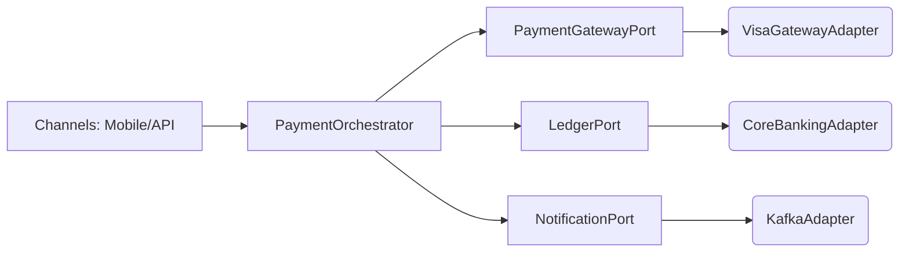

> A pragmatic guide to applying **SOLID** in **banking**—with Java code you can lift into payments, accounts, and risk services.

## Why SOLID matters in banking
In regulated, high‑integrity domains like banking, codebases must be **auditable**, **extensible**, and **safe to change**. SOLID helps you:
- reduce blast radius of change (SRP),
- add new products and rules with minimal code churn (OCP),
- model behaviours precisely (LSP/ISP), and
- isolate domain logic from infrastructure (DIP).

---

## Table of contents
- [Single Responsibility Principle (SRP)](#single-responsibility-principle-srp)
- [Open/Closed Principle (OCP)](#openclosed-principle-ocp)
- [Liskov Substitution Principle (LSP)](#liskov-substitution-principle-lsp)
- [Interface Segregation Principle (ISP)](#interface-segregation-principle-isp)
- [Dependency Inversion Principle (DIP)](#dependency-inversion-principle-dip)
- [Hexagonal (Ports & Adapters) sketch](#hexagonal-ports--adapters-sketch)
- [Testing & compliance benefits](#testing--compliance-benefits)
- [Checklist](#checklist)

---

## Single Responsibility Principle (SRP)
**A class/module should have one reason to change.**

### Real world: Card payment orchestration
A \*God\* `PaymentService` that validates KYC, checks limits, posts to the ledger, calls gateways, and sends events is brittle.

#### ❌ Anti‑example (does too much)
```java
class PaymentService {
    void process(PaymentRequest req) {
        validateKyc(req.customerId());
        checkRisk(req);
        checkLimits(req);
        var auth = authorizeWithGateway(req);
        postToLedger(auth);
        publishNotifications(auth);
        audit(req, auth);
    }
}
```

#### ✅ Refactor by responsibilities
```java
interface KycChecker { void verify(String customerId); }
interface RiskChecker { void assess(PaymentRequest req); }
interface LimitsChecker { void validate(PaymentRequest req); }
interface GatewayAuthorizer { AuthResult authorize(PaymentRequest req); }
interface LedgerPoster { void post(AuthResult auth); }
interface Notifier { void paymentAuthorized(AuthResult auth); }
interface Auditor { void record(PaymentRequest req, AuthResult auth); }

class PaymentOrchestrator {
    private final KycChecker kyc;
    private final RiskChecker risk;
    private final LimitsChecker limits;
    private final GatewayAuthorizer gateway;
    private final LedgerPoster ledger;
    private final Notifier notifier;
    private final Auditor auditor;

    PaymentOrchestrator(KycChecker kyc, RiskChecker risk, LimitsChecker limits,
                        GatewayAuthorizer gateway, LedgerPoster ledger,
                        Notifier notifier, Auditor auditor) {
        this.kyc = kyc; this.risk = risk; this.limits = limits;
        this.gateway = gateway; this.ledger = ledger;
        this.notifier = notifier; this.auditor = auditor;
    }

    void process(PaymentRequest req) {
        kyc.verify(req.customerId());
        risk.assess(req);
        limits.validate(req);
        var auth = gateway.authorize(req);
        ledger.post(auth);
        notifier.paymentAuthorized(auth);
        auditor.record(req, auth);
    }
}
```
Each class now has one reason to change (e.g., a new limits policy only touches `LimitsChecker`).

---

## Open/Closed Principle (OCP)
**Open for extension, closed for modification.**

### Real world: Fees/charges strategy
New product types (e.g., premium accounts) should be added without editing existing fee code.

#### ✅ Strategy pattern for fees
```java
interface FeePolicy {
    Money feeFor(PaymentRequest req);
}

class StandardFee implements FeePolicy {
    public Money feeFor(PaymentRequest req) { return Money.of("GBP", 0.20); }
}

class PremiumFee implements FeePolicy {
    public Money feeFor(PaymentRequest req) { return Money.zero("GBP"); }
}

class MerchantTieredFee implements FeePolicy {
    public Money feeFor(PaymentRequest req) {
        return req.amount().isGreaterThan(Money.of("GBP", 1000))
                ? Money.of("GBP", 1.50) : Money.of("GBP", 0.50);
    }
}

class FeeCalculator {
    private final Map<String, FeePolicy> policies;
    FeeCalculator(Map<String, FeePolicy> policies) { this.policies = policies; }
    public Money calculate(String policyName, PaymentRequest req) {
        return policies.getOrDefault(policyName, new StandardFee()).feeFor(req);
    }
}
```
Add a new fee by implementing `FeePolicy`—no edits to `FeeCalculator`.

### Real world: Pluggable KYC/risk rules
```java
interface Rule<T> { void evaluate(T ctx) throws RuleViolation; }
class Ruleset<T> {
    private final List<Rule<T>> rules;
    Ruleset(List<Rule<T>> rules) { this.rules = rules; }
    void run(T ctx) { rules.forEach(r -> r.evaluate(ctx)); }
}
```
New KYC/risk rules are added as new `Rule` implementations.

---

## Liskov Substitution Principle (LSP)
**Subtypes must be substitutable for their base type without breaking expectations.**

### Real world: Accounts with/without withdrawal capability
A fixed deposit account often **does not** allow withdrawals until maturity. If `FixedDepositAccount` extends `Account` that exposes `withdraw`, it will violate LSP by throwing or no‑op.

#### ✅ Model capabilities explicitly
```java
interface Account { Money balance(); }
interface Withdrawable { void withdraw(Money amount); }
interface Depositable { void deposit(Money amount); }

class CheckingAccount implements Account, Withdrawable, Depositable {
    private Money balance;
    public Money balance() { return balance; }
    public void withdraw(Money amount) { balance = balance.minus(amount); }
    public void deposit(Money amount) { balance = balance.plus(amount); }
}

class FixedDepositAccount implements Account, Depositable {
    private Money balance;
    public Money balance() { return balance; }
    public void deposit(Money amount) { balance = balance.plus(amount); }
    // no withdraw here – avoids breaking LSP
}

class Atm {
    void cashOut(Withdrawable source, Money amount) { source.withdraw(amount); }
}
```
Consumers that require withdrawals depend on `Withdrawable`, not on a broad `Account` type.

---

## Interface Segregation Principle (ISP)
**Prefer many small, specific interfaces over a single fat one.**

### Real world: Payment operations vary by instrument
Not every instrument supports refund/chargeback (e.g., FPS bank transfer vs. card).

```java
interface Authorizable { AuthResult authorize(PaymentRequest req); }
interface Capturable { void capture(AuthResult auth); }
interface Refundable { void refund(String paymentId, Money amount); }

class CardGateway implements Authorizable, Capturable, Refundable { /* ... */ }
class BankTransferGateway implements Authorizable { /* capture/refund not supported */ }

class CaptureJob {
    private final Capturable capturable;
    CaptureJob(Capturable capturable) { this.capturable = capturable; }
    void run(AuthResult auth) { capturable.capture(auth); }
}
```
Clients only depend on the capabilities they actually use.

---

## Dependency Inversion Principle (DIP)
**Depend on abstractions (ports), not concretions (adapters).**

### Real world: Ports & Adapters around payment orchestration
Keep domain logic independent from infrastructure so you can swap Kafka → EventHub, REST → gRPC, or even vendor gateways without touching the core.

```java
// Domain ports (abstractions)
interface PaymentGatewayPort { AuthResult authorize(PaymentRequest req); }
interface LedgerPort { void post(AuthResult auth); }
interface NotificationPort { void paymentAuthorized(AuthResult auth); }

// High-level policy depends on ports
class PaymentOrchestrator {
    private final PaymentGatewayPort gateway;
    private final LedgerPort ledger;
    private final NotificationPort notifier;
    PaymentOrchestrator(PaymentGatewayPort gateway, LedgerPort ledger, NotificationPort notifier) {
        this.gateway = gateway; this.ledger = ledger; this.notifier = notifier;
    }
    void process(PaymentRequest req) {
        var auth = gateway.authorize(req);
        ledger.post(auth);
        notifier.paymentAuthorized(auth);
    }
}

// Infrastructure adapters (implement ports)
class VisaGatewayAdapter implements PaymentGatewayPort { /* calls Visa APIs */ }
class CoreBankingLedgerAdapter implements LedgerPort { /* posts double-entry */ }
class KafkaNotifierAdapter implements NotificationPort { /* emits domain events */ }
```

---

## Hexagonal (Ports & Adapters) sketch


---

## Testing & compliance benefits
- **Unit tests**: Mock ports to test domain flows deterministically.
- **Contract tests**: Verify adapters against external systems (e.g., card gateway).
- **Traceability**: SRP and DIP make audit trails easier (each component emits clear events/logs).
- **Risk control changes**: New rules via OCP `Rule` plugins reduce PR size and audit burden.

---

## Checklist
- SRP: Do classes have one reason to change?
- OCP: Can I add a new product/rule without editing existing core classes?
- LSP: Are capabilities modeled to avoid runtime exceptions in subtypes?
- ISP: Are interfaces narrowly tailored to what clients need?
- DIP: Does domain depend only on ports, with adapters at the edges?

---

### Notes
- The code is framework‑agnostic. In Spring, wire these via interfaces/`@Configuration`.
- Use value types for `Money` and identifiers; avoid primitives for currency‑sensitive logic.


