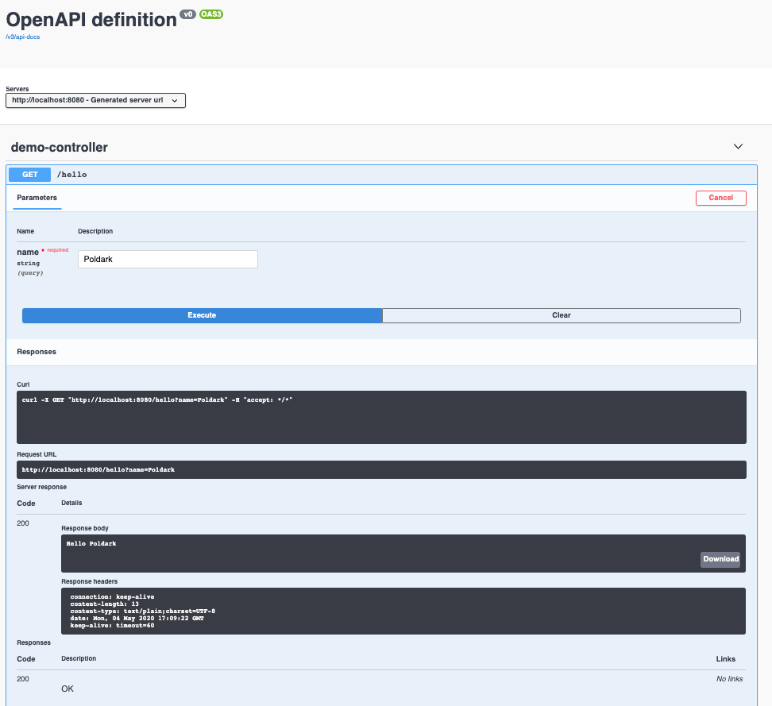

# Swagger UI Demo

1. Git clone [project](https://github.com/ahoqueali/ahoqueali.github.io/tree/master/swagger-demo) `git clone https://github.com/ahoqueali/ahoqueali.github.io`
2. Cd into swagger-demo
3. Start demo app `./gradlew bootRun`
4. Go to Swagger UI [http://localhost:8080/swagger-ui.html](http://localhost:8080/swagger-ui.html) and clink on the `Try it out` button
5. Type a name that has more than 5 characters and click on the `execute` button

The URLs below allow access to the Swagger Specs
6. JSON Swagger Spec [http://localhost:8080/v3/api-docs/](http://localhost:8080/v3/api-docs/)
7. YAML Swagger Spec [http://localhost:8080/v3/api-docs.yaml](http://localhost:8080/v3/api-docs.yaml)

# Swagger Request Validator Demo

7. Whilst the  demo app is running, open a terminal and execute the following curl command `curl http://localhost:8080/hello\?name\=Ross`
8. The message below will be shown.. The error is produced by the Swagger Request Validator after intercepting the request as the name cannot be less than 5 chars

See [source](https://github.com/ahoqueali/ahoqueali.github.io/tree/master/swagger-demo) for implementation details.

## Reference
1. [Documenting a Spring REST API Using OpenAPI 3.0](https://www.baeldung.com/spring-rest-openapi-documentation)
2. [Swagger Request Validator](https://bitbucket.org/atlassian/swagger-request-validator/src/master/swagger-request-validator-springmvc/)
